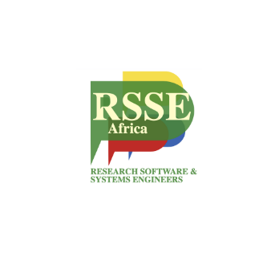
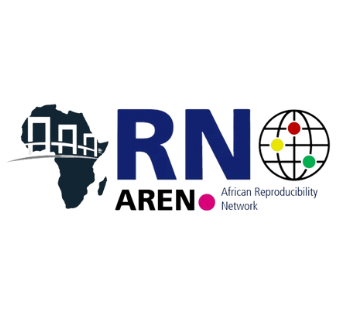

# RSSE OPEN SCIENCE SERIES 2024/2025

## About this repository

This repository provides a way for the organisers of the planned 12+month series on _Open Science_ and _Research Software and Systems_ to discuss and keep track of decisions and suggestions.

## About the RSSE Open Science Series

We are planning a monthly virtual discussion series aimed at increasing the participation of African and Asian researchers involved in developing and maintaining research software and systems (data/computing hardware) in the [global RSE movement.](https://www.software.ac.uk/blog/not-so-brief-history-research-software-engineers-0).

The series focuses on the link between research software (and systems) and open science and how these technologies can and should be employed to enable open science.

## Lead partners

The series is co-designed by members of the following organisations and groups:

| Organisation  | People | ORCID |
|-|-|-|
| [Talarify](https://talarify.co.za) | _Anelda van der Walt_ | <a href="https://orcid.org/0000-0003-4245-8119">https://orcid.org/0000-0003-4245-8119</a> |
|  [RSSE Africa](https://rsse.africa) |_Mireille Grobbelaar_ |<a href="https://orcid.org/0000-0002-1959-4756">https://orcid.org/0000-0002-1959-4756</a> |
| |_Richard Mudahera Dushime_| <a href="https://orcid.org/0000-0002-1281-9895">https://orcid.org/0000-0002-1281-9895</a> |
| [RSE Asia](https://rse-asia.github.io/RSE_Asia/) | _Jyoti Bhogal_ | <a href="https://orcid.org/0000-0002-6289-0737">https://orcid.org/0000-0002-6289-0737</a> |
| | _Saranjeet Kaur_ | <a href="https://orcid.org/0000-0002-7038-1457">https://orcid.org/0000-0002-7038-1457</a> |
| [The African Reproducibility Network](https://africanrn.org/) | _Emmanuel Boakye_ | <a href="https://orcid.org/0000-0003-2043-5952">https://orcid.org/0000-0003-2043-5952</a> |
| | _Lamis Elkheir_ | <a href="https://orcid.org/0000-0002-3516-334X">https://orcid.org/0000-0002-3516-334X</a> |
| [The Research Software Alliance](https://www.researchsoft.org/) | Talarify | ReSA African Community Engagement Partner |
| | RSE Asia | ReSA Asian Community Engagement Partner |

<table align="center">
    <tr>
        <td align="center"></td>
        <td align="center"></td>
        <td align="center"></td>
        <td align="center"></td>
        <td align="center"></td>
    </tr>
</table>

## What is research software?

> Research Software includes source code files, algorithms, scripts, computational workflows and executables that were created during the research process or for a research purpose.
> Software components (e.g., operating systems, libraries, dependencies, packages, scripts, etc.) that are used for research but were not created during or with a clear research intent
> should be considered software in research and not Research Software. This differentiation may vary between disciplines. The minimal requirement for achieving computational reproducibility
> is that all the computational components (Research Software, software used in research, documentation and hardware) used during the research are identified, described, and made accessible
> to the extent that is possible.

_Read the full FAIR for Research Software working group (FAIR4RS) report at https://doi.org/10.5281/zenodo.5504015_.

## What is open science?

> Open science is a set of principles and practices that aim to make scientific research from all fields accessible to everyone for the benefit of scientists and society as a whole.
> Open science is about making sure not only that scientific knowledge is accessible but also that the production of that knowledge itself is inclusive, equitable and sustainable.

_Read more about Open Science on the [UNESCO Open Science pages](https://www.unesco.org/en/open-science/about?hub=686)_.

## Why do we talk about _OPEN SCIENCE_ and _RESEARCH SOFTWARE_ together?

Although many people realise that open-access publications enable open science, the link between open science and the software created for data wrangling, analysis, visualisation, and more isn't always clear. The [UNESCO Recommendations on Open Science](https://www.unesco.org/en/open-science/about?hub=686) reference 14 open science pillars. Under _Open Science Knowledge_, we find the _Open Source Software and Source Code_ pillar, and under _Open Science Infrastructures_, we find both physical and virtual infrastructure that enables research (this includes infrastructure that enables data storage and analyses).

<a href="https://commons.wikimedia.org/wiki/File:UNESCO-Open_science-pillars-en.png">Open Science Pillars. UNESCO.org</a>, <a href="https://creativecommons.org/licenses/by-sa/4.0">CC BY-SA 4.0</a>, via Wikimedia Commons

