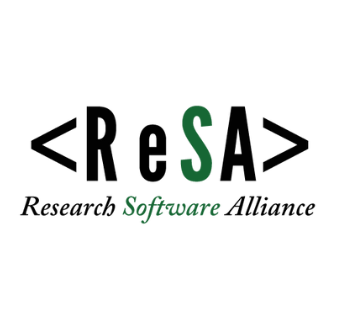

# RSSE OPEN SCIENCE SERIES 2024/2025

## About this repository

This repository provides a way for the organisers of the planned 12+month series on _Open Science_ and _Research Software and Systems_ to discuss and keep track of decisions and suggestions.

## About the RSSE Open Science Series

We are planning a monthly virtual discussion series aimed at increasing the participation of African and Asian researchers involved in developing and maintaining research software and systems (data/computing hardware) in the [global RSE movement.](https://www.software.ac.uk/blog/not-so-brief-history-research-software-engineers-0).

The series focuses on the link between research software (and systems) and open science and how these technologies can and should be employed to enable open science.

## Lead partners

The series is co-designed by members of the following organisations and groups:

| Organisation/Group | People | ORCID |
|-|-|-|
| [Talarify](https://talarify.co.za) | _Anelda van der Walt_ | <a href="https://orcid.org/0000-0003-4245-8119">https://orcid.org/0000-0003-4245-8119</a> |
|  [RSSE Africa](https://rsse.africa) |_Mireille Grobbelaar_ |<a href="https://orcid.org/0000-0002-1959-4756">https://orcid.org/0000-0002-1959-4756</a> |
| |_Richard Mudahera Dushime_| <a href="https://orcid.org/0000-0002-1281-9895">https://orcid.org/0000-0002-1281-9895</a> |
| [RSE Asia](https://rse-asia.github.io/RSE_Asia/) | _Jyoti Bhogal_ | <a href="https://orcid.org/0000-0002-6289-0737">https://orcid.org/0000-0002-6289-0737</a> |
| | _Saranjeet Kaur_ | <a href="https://orcid.org/0000-0002-7038-1457">https://orcid.org/0000-0002-7038-1457</a> |
| [The African Reproducibility Network](https://africanrn.org/) | _Emmanuel Boakye_ | <a href="https://orcid.org/0000-0003-2043-5952">https://orcid.org/0000-0003-2043-5952</a> |
| | _Lamis Elkheir_ | <a href="https://orcid.org/0000-0002-3516-334X">https://orcid.org/0000-0002-3516-334X</a> |
| [The Research Software Alliance](https://www.researchsoft.org/) | | |

<table align="center">
    <tr>
        <td align="center"></td>
        <td align="center"></td>
        <td align="center"></td>
        <td align="center"></td>
        <td align="center"></td>
    </tr>
</table>
